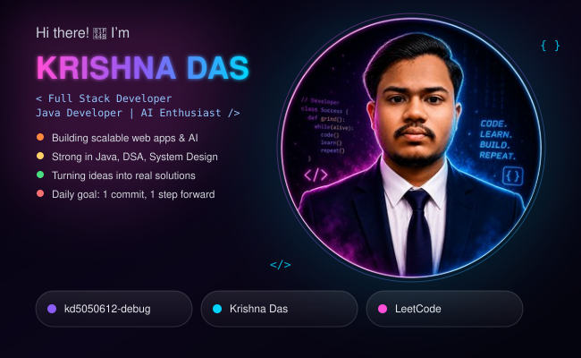

<div align="center">



</div>

<div align="center">



</div>

<div align="center">


<p align="center">

</p>

<p align="center">


</p>

</div>

---

<table>
<tr>

<td width="60%" valign="top">

# 👨‍💻 About This Repository

Welcome to my **Developer Portfolio & Coding Journey** 🚀

This repository showcases my work as a **Full Stack Web Developer**, **AI Developer**, and **Data Structures & Algorithms (DSA) Enthusiast**. It serves as a central hub for my projects, coding practice, innovative projects, and continuous learning.
---


## 📈 Current Focus

```text
🌐 Full Stack Development      ████████████░░░ 85%
🤖 Artificial Intelligence     ██████████░░░░ 75%
⚡ Data Structures & Algorithms ███████████░░ 80%
📚 Continuous Learning         ██████████████ 100%
```

---

⭐ **If you like my work, don't forget to star this repository!**

</td>

<td width="40%" align="center">

<div align="center">


</div>

<div align="center">

</td>

</tr>
</table>

---
---

<div align="center">


</div>

---

# 🌐 Connect With Me

<p align="center">

<a href="https://www.linkedin.com/in/krishna-das-194155349">

</a>

<a href="https://www.instagram.com/anime_fantasy_07">

</a>

<a href="mailto:kri123sh45na@gmail.com">

</a>

<a href="https://discord.gg/xvF4tyTC5">

</a>

</p>

---
<div align="center">


</div>

# 💻 Tech Stack

<p align="center">


</p>

---

<h2 align="center">🏆 GitHub Achievements</h2>

<p align="center">
  
</p>

<p align="center">
  <i>🚀 Building • Learning • Contributing • Growing</i>
</p>

# 🚀 Featured Projects

| Project | Description |
|----------|-------------|
| 🌾 AgroShield AI | AI Powered Crop Disease Detection |
| 🎓 Centralized Academic Access Portal | University ERP System |
| 🎬 Movie Rental Management System | Java + MySQL |
| 🌐 Portfolio Website | React + Tailwind |
| 🤖 AI Research Projects | Machine Learning & Computer Vision |

---

# ✍️ Random Dev Quote

<div align="center">


</div>

---

# 🐍 Contribution Snake

<picture>

<source media="(prefers-color-scheme: dark)"
srcset="https://raw.githubusercontent.com/kd5050612-debug/kd5050612-debug/output/github-snake-dark.svg">

<source media="(prefers-color-scheme: light)"
srcset="https://raw.githubusercontent.com/kd5050612-debug/kd5050612-debug/output/github-snake.svg">


</picture>

---

# 💡 Fun Fact

```text
while(alive){
    eat();
    sleep();
    code();
    repeat();
}
```

---

<div align="center">

### ⭐ Thanks for visiting my profile! ⭐

### 🚀 Let's Build Something Amazing Together!


</div>
